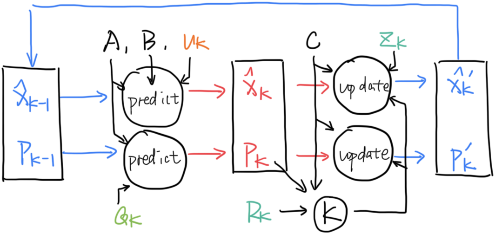

# 卡尔曼滤波

> 本文极大程度上参考了[这篇Bzarg的文章][Bzarg.KalmanFilter]，强烈推荐去读读原文。

> 如果你有现代控制理论的基础（了解状态空间表示），读这篇文章会相对容易。

假设我们已经获得了当前估计状态$\mathbf{x_k}$，它是一个多元随机变量，因而应该有均值$\mathbf{\mu}$和协方差矩阵$\mathbf{\Sigma}$。

我们用均值来代表最优估计，且把协方差矩阵写为$\mathbf{P_k}$，即

$$
\begin{align}
    & \mathbf{\hat{x}_k} = \mathbf{\mu} \\
    & \mathbf{P_k} = \mathbf{\Sigma}
\end{align} 
$$

假设状态包括当前速度和位置两个标量，输入为加速度，那么应该有状态转移方程

$$
x_{k+1} = A x_k + Gu
$$

其中

$$
\begin{align}
    x_k &=
    \begin{bmatrix}
        p_k\\
        v_k\\
    \end{bmatrix}\\
    A &= 
    \begin{bmatrix}
    1 & \Delta t\\
    0 & 1
    \end{bmatrix} \\
    B &=
    \begin{bmatrix}
        \frac{1}{2}\Delta t^2 \\
        \Delta t
    \end{bmatrix} \\
    u &= a
\end{align}
$$

由于

$$
\begin{align}
    E(Ax) & = AE(x) \\
    \mathrm{cov}(Ax) & = A\mathrm{cov}(x)A^T
\end{align}
$$

有最优估计和协方差矩阵的递推公式

$$
\begin{align}
    \mathbf{\hat{x}_{k+1}} &= A\mathbf{\hat{x}_k} + Bu \\
    \mathbf{P_{k+1}} &= A\mathbf{P_k}A^T
\end{align}
$$

如果假设每一步状态转移时，环境都会向状态引入一个高斯白噪声（期望为0），假设其与当前状态相互独立，由协方差的性质

$$
\mathrm{cov}(\sum_i X_i,\sum_j Y_j)=\sum_i \sum_j \mathrm{cov}(X_i,Y_j)
$$

可得，只需在上式后加一个噪声的协方差矩阵$\mathbf{Q_k}$

$$
\begin{align}
    \mathbf{P_{k+1}} = A\mathrm{P_k}A^T + \mathbf{Q_k}
\end{align}
$$

现在我们引入观测矩阵。就是说，现实中的物理量经过一个非奇异线性变换（也就是这个观测矩阵），变成了传感器读取到的数据。

$$
\begin{align}
    \mathbf{y_k} = C\mathbf{x_k}
\end{align}
$$

那么有

$$
\begin{align}
    \mathbf{\hat{y}_k} &= C \mathbf{\hat{x}_k} \\
    \mathbf{\Sigma _y} &= C\mathbf{P_k}C^T
\end{align}
$$

至此，我们知道了如何从上一时刻观测向量的最优估计状态，推测出这一时刻的最优估计状态：

$$
\begin{align}
    \mathbf{\hat{y}_k} &= CA\mathbf{\hat{x}_{k-1}} + Bu \\
    &= CAC^{-1}\mathbf{\hat{y}_{k-1}} + Bu \\
    \mathbf{\Sigma _{y_k}} &= CAC^{-1}\mathbf{\Sigma _{y_{k-1}}}(C^{-1})^T A^TC^T
\end{align}
$$

同时，我们可以把从传感器中读到的数据$\mathbf{\hat{z}_k}$看作另一个随机变量的均值，假设这一随机变量也符合高斯分布，且具有协方差矩阵$\mathbf{R_k}$。

我们的递推公式认为，当前传感器的真实数据最可能是$\mathbf{\hat{y}_k}$，它具有协方差$\mathbf{\Sigma _{y_k}}$，而传感器认为，当前传感器的真实数据最可能是$\mathbf{\hat{z}_k}$，它具有协方差$\mathbf{R_k}$。**将两个高斯分布作乘积，新的分布的均值就是传感器真实状态的最优估计值。**

> 怎么理解呢？A认为这里更可能发现宝藏，理由是他有藏宝图（预测），B认为那里更可能发现宝藏，理由是他有探测器（读取）。听谁的？二者折中一下吧。

对于两个独立的服从正态分布的随机变量，其密度函数（Probability Density Function）的乘积是另一个正态分布的密度函数乘以一个缩放因子，即

$$
\begin{align}
    f(x) &= \frac{1}{\sqrt{2\pi}\sigma _1} e^{-\frac{(x-\mu _1)^2}{2\sigma _1 ^2}} \\
    g(x) &= \frac{1}{\sqrt{2\pi}\sigma _2} e^{-\frac{(x-\mu _2)^2}{2\sigma _2 ^2}} \\
    h(x) &= f(x)\cdot g(x) \\
    &= A \cdot \frac{1}{\sqrt{2\pi}\sigma _0} e^{-\frac{(x-\mu _0)^2}{2\sigma _0 ^2}}
\end{align}
$$

其中

$$
\begin{align}
    A &= \frac{e^{-\frac{(\mu_1-\mu_2)^2}{2(\sigma_1^2+\sigma_2^2)}}}{\sqrt{2\pi( \sigma_1^2+\sigma_2^2)}} \\
    \mu _0 &= \frac{\mu_1\sigma_2^2+\mu_2\sigma_1^2 }{\sigma_1^{2}+\sigma_2^{2}} \\
    \sigma _0 &= \frac{\sigma_1^2\sigma_2^2}{\sigma_1^2+\sigma_2^2}
\end{align}
$$

> 对多元随机变量也成立，将对应标量替换为矩阵即可。

这样，我们就得到了传感器对应的真实数据的最优估计

$$
\begin{align}
    \mathbf{\hat{y}'_k} &= \mathbf{\hat{y}_k} + \mathbf{K}(\mathbf{\hat{z}_k} - \mathbf{\hat{y}_k}) \\
    \mathbf{\Sigma _{y_k}'} &= \mathbf{KR_k} = \mathbf{\Sigma _{y_k}} -  \mathbf{K \Sigma _{y_k}}\\
    \mathbf{K} &= \mathbf{\Sigma _{y_k}}(\mathbf{\Sigma _{y_k}} + \mathbf{R_k})^{-1}
\end{align}
$$

> $\mathbf{K}$即卡尔曼增益（Kalman Gain）。

但通常我们需要获取$\mathbf{\hat{x}'_k}$和$\mathbf{P'_k}$，有

$$
\begin{align}
    \mathbf{\hat{x}'_k} &= \mathbf{\hat{x}_k} + C^{-1}\mathbf{K}(\mathbf{\hat{z}_k} - C\mathbf{\hat{x}_k}) \\
    \mathbf{P'_k} &= C^{-1}\mathbf{KR_k}(C^{-1})^T \\
    &= \mathbf{P_k}-C^{-1}\mathbf{K}C\mathbf{P_k} \\
    \mathbf{K} &= C\mathbf{P_k}C^T(C\mathbf{P_k}C^T + \mathbf{R_k})^{-1}
\end{align}
$$

用一张图（也抄自[这篇Bzarg的文章][Bzarg.KalmanFilter]）总结一下卡尔曼滤波的过程：

[Bzarg.KalmanFilter]: https://www.bzarg.com/p/how-a-kalman-filter-works-in-pictures/